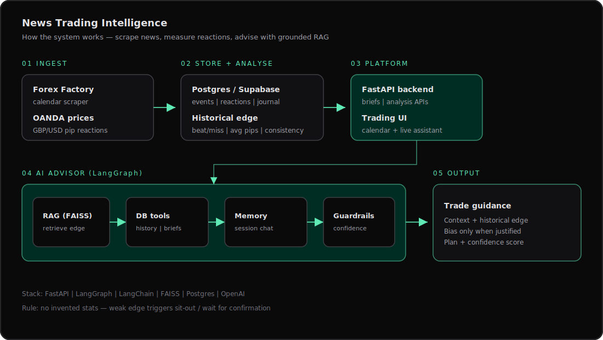

# News Trading Intelligence

GBP/USD **news-trading** platform: scrape the economic calendar, measure historical price reactions, and ask a grounded AI advisor for trade guidance — with RAG, tools, memory, and confidence guardrails.

<p align="center">
  
</p>

<p align="center"><em>How it works — ingest news &amp; reactions, analyse edge, advise with guarded RAG</em></p>

---

## What it does

| Capability | Description |
|------------|-------------|
| **Calendar ingest** | Scrapes Forex Factory for USD/GBP red & orange news events |
| **Reaction analytics** | Measures GBP/USD pip moves (5M / 15M / 30M) via OANDA after releases |
| **Edge summaries** | Beat/miss direction, consistency, and tradeable-event scoring |
| **Trade journal** | Notes, ratings, and past trades used as advisor context |
| **AI advisor** | LangGraph agent with FAISS RAG, DB tools, session memory, and guardrails |

The advisor is built for a **news-reaction strategy** — it cites historical edge, states directional bias only when justified, and otherwise recommends sitting out.

---

## Architecture

```
Forex Factory ──┐
                ├──▶ Postgres / Supabase ──▶ FastAPI + Trading UI
OANDA prices  ──┘              │
                               ▼
                     LangGraph AI Advisor
                RAG (FAISS) · Tools · Memory · Guardrails
                               │
                               ▼
                      Trade guidance (bias / plan / confidence)
```

### Agent package (`agent/`)

| Module | Role |
|--------|------|
| `graph.py` | LangGraph orchestration + streaming chat |
| `rag.py` | FAISS index over events, ratings, and journal |
| `tools.py` | Structured DB lookups (analysis, history, briefs) |
| `memory.py` | Session persistence in Postgres |
| `guardrails.py` | Confidence checks — refuse weak-edge directional advice |

---

## Tech stack

- **Backend:** FastAPI, Uvicorn, Pydantic
- **Data:** Postgres / Supabase, BeautifulSoup, curl_cffi
- **AI:** LangChain, LangGraph, FAISS, OpenAI (chat + embeddings)
- **Frontend:** Static trading UI (`index.html` / `public/`)

---

## Quick start

### 1. Environment

```bash
python -m venv .venv
source .venv/bin/activate   # Windows: .venv\Scripts\activate
pip install -r requirements.txt

cp .env.example .env
# Set DATABASE_URL, OPENAI_API_KEY (and optional SUPABASE_URL)
```

### 2. Run

```bash
chmod +x start.sh
./start.sh
# or: uvicorn app:app --reload --port 8000
```

Open **http://localhost:8000**

Health check: `GET /api/health`

---

## Project layout

```
trading-view/
├── app.py              # FastAPI backend + API routes
├── scraper.py          # Forex Factory + OANDA reaction engine
├── db.py               # Postgres / Supabase connection helpers
├── agent/              # LangGraph RAG advisor
│   ├── graph.py
│   ├── rag.py
│   ├── tools.py
│   ├── memory.py
│   └── guardrails.py
├── public/             # UI assets
├── docs/
│   └── architecture.svg
├── requirements.txt
└── .env.example
```

---

## Safety notes

- Never invent statistics — the agent must cite retrieved data or say data is missing.
- Weak historical edge (low avg pips / low consistency) → **sit out** or wait for confirmation.
- Keep secrets in `.env` only (never commit API keys or database dumps).

---

## Author

[Muhammed Salim](https://github.com/Muhamme-AI) — AI Engineer / Forward Deployed Engineer

Portfolio: [mosalim.dev](https://mosalim.dev)
